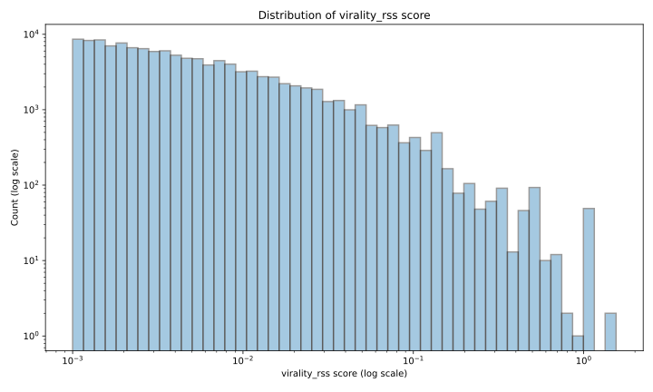
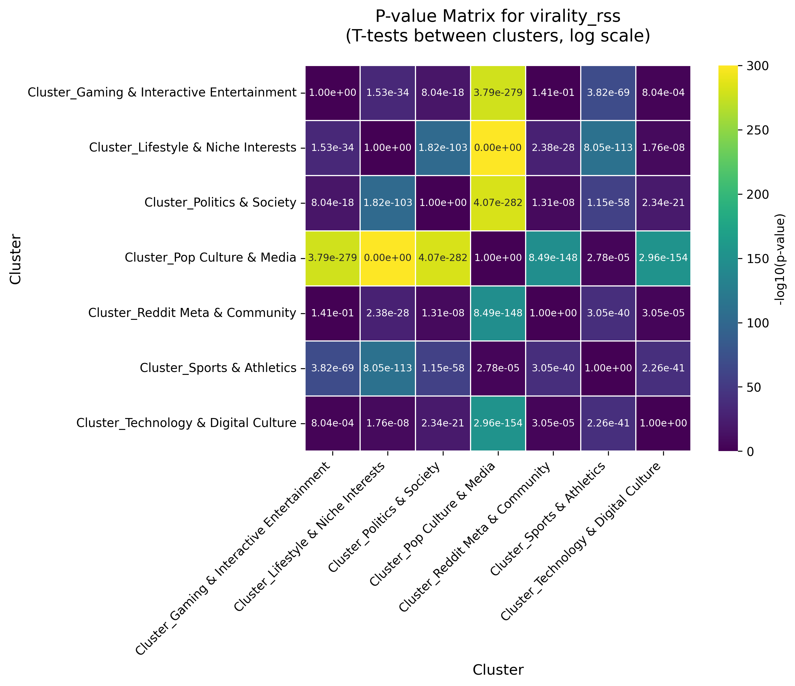
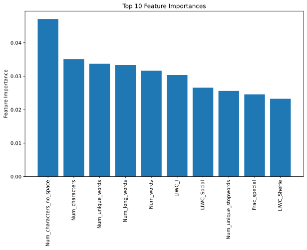

# Preface 🗿

Every cookbook preface is unnecessarily long and emotional. We will spare you that part 🥱.  
Every cookbook preface ends with a simple promise: follow these recipes, and you’ll create something unforgettable 😏. 
This one keeps that promise - although what you create might be unforgettable for… different reasons. 
Welcome to **Toxic Stew**, a data-powered guide to the secret ingredients behind _virality_ on Reddit.
Before diving into the dishes, let’s prepare our ingredients.

# Ingredients / Dataset

## Basic Ingredients - Base Dataset 🧑‍🌾

The basic ingredients are extracted from the [Stanford SNAP Reddit datasets](https://snap.stanford.edu/data/index.html):

- **858,490 hyperlinks** between 55,863 subreddits
- Sentiment analysis of cross-subreddit posts
- Text properties including readability, sentiment, and linguistic features
- Temporal data spanning January 2014 to April 2017
- **[Reddit Hyperlinks Network](https://snap.stanford.edu/data/soc-RedditHyperlinks.html)**: A directed, signed, temporal network of subreddit-to-subreddit hyperlinks with rich text features and sentiment annotations.

## The Seasoning - Subreddit Embeddings 🧂
The seasoning, which makes the stew more enjoyable is also extracted from [Stanford SNAP Reddit datasets](https://snap.stanford.edu/data/index.html):

- **300 dimensional embeddings for each subreddit** for more than 30,000 subreddits
- Covers more than 90% of the crosslinking posts
- Allows for similarity analysis of subreddits
- Used for clustering

## The Topping - API enhancement 🌶️

The following ingredients are optional but highly recommended for more sophisticated and advanced taste palettes. It cannot be found in the basic dataset, one must go to data scraping. The data has been lawfully scraped across **150 hours** from the official Reddit API.  
Ultimately, end up with additional ingredients:

- `ups` (number of upvotes)
- `downs` (number of downvotes)
- `num_comments` (number of comments)
- `score` (number of upvotes - number of downvotes)
- `upvote_ratio` (number of upvotes / number of votes)
- `subreddit_subscribers` (number of subscribers to source subreddit)

## Ingredient Summary
We made sure that the ingredients of our cookbook work well together. In the following plot, we show that these ingredients leave us with a large share of posts that we can integrate in our stew. We lost some posts that cannot be mapped to clusters, as we are missing the subreddit embeddings, and some that are not available to be scraped on Reddit since they have been removed. These can be considered like the bad part of an avocado that we have to sacrifice in order to make the overall stew better. And who knows, some of these posts might be used later in the cookbook again. Additionally, we used plots that appear multiple times in the dataset (due to multiple links) only once, as they would otherwise add a heavy bias. But this information is not completely unused, as we elaborate on later. 👀

<noscript></noscript>

## Secret Ingredient - Virality 🪺
Oh, and we almost forgot the most important part. For the first time in history, we  reveal the top secret of our trade. This is truly the ingredient that will make your stew irresistible to all your friends (and enemies) alike. It is something you can only make yourself; it is not sold by any gypsies in any markets anywhere in the world. This ingredient is ✨virality✨. More particularly, _relative virality score per subscriber_ (`virality_rss`) And the secret formula to make this metric is as follows:   
`virality_rss` = (2* `ups` + `downs`) / sqrt(`subreddit_subscribers` + 1)   
What makes this metric so special is that is really captures the essence of what it is to be viral in a given community. With the denominator containing <i>subreddit_subscribers</i>, the virality standard accounts for the size of the subreddit in which the post originates. To be considered viral in a bigger community, a bigger score is needed, and virality is not penalized if the community itself is smaller.  
Virality is studied through the lens of a hyperlink network. Rather than treating virality as popularity within a single community, we account for the spread of content between communities. Engagement signals (e.g. upvotes) are taken in the context of cross-linked posts, so a post that attracts disproportionately high engagement relative to typical posts in its community (i.e. following exposure through a hyperlink from another community) is more viral, capturing how attention propagates across Reddit.
revolve around a low virality rss score. Only a few outliers can be spotted on the viral part of the metric. 
# Setting the Table - Community detection 🍽️

As you are cooking, it is important to keep your space clean. Any chef knows that dry and wet ingredients must be mixed separately, and proper cleaning practices need to be observed to prevent cross-contamination, food poisoning, and death 🪦.  
We take subreddit embeddings from **[Reddit Embeddings](https://snap.stanford.edu/data/web-RedditEmbeddings.html)** which includes vector representations of subreddits and users for advanced analysis. We then perform Leiden clustering with params (TODO: ...) and organize them formally to get the following clusters. A complex Gemini LLM pipeline helped us to name the clusters of all levels by (TODO ...). At the end this gives us 7 distinct clusters which can be viewed as larger Reddit communities.

<strong>🧑‍🍳 For cooking nerds: Leiden clustering</strong>



We use <strong>Leiden clustering</strong> to find groups of similar subreddits. The algorithm works by maximizing <strong>modularity</strong> — basically, it tries to group nodes so that communities have lots of internal connections but few connections between them.

The modularity score looks like this:

$$
Q = \frac{1}{2m} \sum_{i,j} \left( w_{ij} - \frac{k_i k_j}{2m} \right)\,\mathbb{1}(c_i = c_j)
$$

Breaking this down:

<ul>
  <li>$Q$ is the <strong>modularity</strong> (higher = better clustering),</li>
  <li>$w_{ij}$ is how strongly nodes $i$ and $j$ are connected,</li>
  <li>$k_i = \sum_j w_{ij}$ is the total weight of all edges touching node $i$,</li>
  <li>$m = \frac{1}{2} \sum_{i,j} w_{ij}$ is the total weight of all edges,</li>
  <li>$c_i$ is which cluster node $i$ belongs to,</li>
  <li>$\mathbb{1}(c_i = c_j)$ equals 1 when nodes $i$ and $j$ are in the same cluster, 0 otherwise.</li>
</ul>

The key idea: modularity compares actual connections between nodes to what we'd <em>expect</em> if edges were randomly placed (but keeping the same number of connections per node). High modularity means communities are way more connected internally than random chance would predict.

Leiden iteratively shuffles nodes between clusters to push $Q$ higher, moving individual nodes and sometimes entire groups. We run this at multiple resolution levels to catch both big thematic clusters and smaller niche communities.

<noscript></noscript>

# Aperitivo - Initial Analysis 🍷
We begin the meal with a light refreshment: a first glimpse at our secret ingredient, _virality_. As the plot shows, the majority of posts revolve around a low virality rss score. Only a few outliers can be spotted on the viral part of the metric. 

Before diving into complex modelling, we take a step back and examine how virality behaves across the different clusters of Reddit communities. The bar chart gives us an early hint: the mean virality score isn’t uniform at all. Some clusters consistently produce more “viral-leaning” posts than others. This tells us that we cannot treat viral posts the same across all clusters. We need to be careful to separate them as being "viral" might have a different meaning in a cluster with higher engagement rates. This, however, does not mean that we cannot be viral at all in the others. 

<noscript></noscript>

It seems like there is a difference between the mean of the virality score (Virality RSS) among communities. Lets do a statistical test to prove this.  

We will use a **t-test** 🫖 between all cluster pairs to understand whether the differences in average virality between these clusters are statistically significant. After performing pairwise _t-tests_ on all clusters, we obtain the following covariance matrix of p-values.

<strong>🧑‍🍳 For cooking nerds: t-test</strong>



To formally test whether differences in average virality between clusters are meaningful,
we use a <strong>two-sample t-test</strong>. The t-test evaluates whether the observed difference
in means between two groups is larger than what would be expected from random variation alone.

<h4>Test statistic</h4>

For two clusters with sample means $\bar{x}_1$, $\bar{x}_2$, variances $s_1^2$, $s_2^2$, and
sample sizes $n_1$, $n_2$, the t-statistic is:

$$
t = \frac{\bar{x}_1 - \bar{x}_2}{\sqrt{\frac{s_1^2}{n_1} + \frac{s_2^2}{n_2}}}
$$

This statistic measures how far apart the cluster means are relative to their pooled uncertainty.

<h4>Hypotheses</h4>

<ul>
  <li><strong>Null hypothesis ($H_0$):</strong> The two clusters have equal mean virality.</li>
  <li><strong>Alternative hypothesis ($H_1$):</strong> The mean virality differs between clusters.</li>
</ul>

<h4>p-value interpretation</h4>

The p-value represents the probability of observing a difference at least as extreme as the one
measured, assuming the null hypothesis is true. A threshold of $p < 0.05$ is used to indicate
statistical significance.

<h4>Application to virality</h4>

In our analysis, we perform pairwise t-tests across all cluster pairs using the
<code>virality_rss</code> metric. Significant p-values indicate that differences in average
virality between clusters are unlikely to be explained by random fluctuation alone, motivating
cluster-specific analyses rather than treating Reddit as a homogeneous population.

<h4>Limitations</h4>

While the t-test detects differences in means, it does not explain <em>why</em> clusters differ,
nor does it account for confounding factors or non-normality. It serves as a diagnostic tool
rather than a causal analysis.

*Most p-values outside main diagonal are below 0.05 (one excecption - gaming & interactive entertainment / pop culture & media). Some are much closer to 0 than others, which we convey with a -log scale on the color bar axis.*

💡Since most p-values are below 0.05, we conclude that the differences in means between our different communities are statistically significant.

# Let Us Cook - Temporal Analysis 🍳

A stew requires time to simmer 🛁, so that the flavours can open up and flourish. In most cases, the tastes blend together in an expected way, but in special situations, one persistent flavour can rise to the top. This brings us to our temporal analysis where we plot `virality_rss` of each cluster overtime. Most posts will end up on the bottom curve, with `virality_rss < 1`, but scattered above, outliers emerge 🦅. We study what separates these posts and makes them have the viral factor:

<ul class="nav nav-tabs" id="viewTabsa" role="tablist">
  <li class="nav-item" role="presentation">
    <button class="nav-link active" id="viewa1-tab" data-toggle="tab" data-target="#viewa1" type="button" role="tab" aria-controls="view1" aria-selected="true">Gaming</button>
  </li>
  <li class="nav-item" role="presentation">
    <button class="nav-link" id="viewa2-tab" data-toggle="tab" data-target="#viewa2" type="button" role="tab" aria-controls="view2" aria-selected="false">Politics</button>
  </li>
  <li class="nav-item" role="presentation">
    <button class="nav-link" id="viewa3-tab" data-toggle="tab" data-target="#viewa3" type="button" role="tab" aria-controls="view3" aria-selected="false">Meta</button>
  </li>
  <li class="nav-item" role="presentation">
    <button class="nav-link" id="viewa4-tab" data-toggle="tab" data-target="#viewa4" type="button" role="tab" aria-controls="view4" aria-selected="false">Lifestyle</button>
  </li>
  <li class="nav-item" role="presentation">
    <button class="nav-link" id="viewa5-tab" data-toggle="tab" data-target="#viewa5" type="button" role="tab" aria-controls="view5" aria-selected="false">Sports</button>
  </li>
  <li class="nav-item" role="presentation">
    <button class="nav-link" id="viewa6-tab" data-toggle="tab" data-target="#viewa6" type="button" role="tab" aria-controls="view6" aria-selected="false">Pop Culture</button>
  </li>
  <li class="nav-item" role="presentation">
    <button class="nav-link" id="viewa7-tab" data-toggle="tab" data-target="#viewa7" type="button" role="tab" aria-controls="view7" aria-selected="false">Technology</button>
  </li>
</ul>

  

    
<noscript></noscript>

  

  
  

    
<noscript></noscript>

  

  
  

    
<noscript></noscript>

  

  
  

    
<noscript></noscript>

  

  
  

    
<noscript></noscript>

  

  

    
<noscript></noscript>

  

  

    
<noscript></noscript>

  

As we can see, some specific clusters have a trend of having a higher virality score over time. For example the pop culture cluster seems to steadily rise across the 3 years of data. We definitely have to take this into account to not add bias! 
Let's give this a closer look, can we find out when exactly the different clusters had peaks? What can we relate them to? We consider communities' popularity over time. We plot the geometric mean of `virality_rss` per cluster over time and watch the race to the top 🐇🐢. 

<noscript></noscript>

💡Oh seems like there is quite a bit of change! What could have driven these? We made sure to do some research on what might have caused the swaps in position of average virality score. Our conclusion? These major events played a key role in shaping the dynamics of the virality race over time, hover over them and find out what impact they had: 

<noscript></noscript>

# Antipasti - Virality Factors 🫒

Now it's finally time to get into the nitty-gritty of virality. What proportions of ingredients are actually needed to go viral? We model virality as a binary outcome using machine learning techniques. We rely on `virality_rss` to define whether a post is viral or not. As we described above, we have to consider the communities and also factor in time, as becoming viral does not mean the same in all places and at all times. We defined the binary variable `is_viral` to tell us whether a given post in our dataset is viral. The rest of the variables are used in the furhter analysis to determine which ones actually determine virality. We also added two more features, <i>num_title_links</i> and <i>num_body_links</i>, which follows our promise that data on duplicate posts is not lost entirely. Could linking multiple posts impact virality, what about other features? We bet you can't wait to find out! 😎

<strong>🧑‍🍳 For cooking nerds: How we defined virality</strong>

TODO for Gal, could you please just put the formula here how you defined virality

## Logistic Regression 🪵
We first train a logistic regression model using `smf.logreg`. This yields the coefficients displayed in the plot below. All of the shown coefficients have p-value below 0.05 (hover over the coefficient so see its full name and its p-value).

<strong>🧑‍🍳 For cooking nerds: Logistic regression</strong>



Logistic regression models the probability of virality using the logistic function:

$$P(\text{is_viral} = 1 | \mathbf{x}) = \sigma(\mathbf{x}^T \boldsymbol{\beta}) = \frac{1}{1 + e^{-(\beta_0 + \sum_{i=1}^{p} \beta_i x_i)}}$$

The log-odds is modeled as a linear combination of features:

$$\text{logit}(p) = \ln\left(\frac{p}{1-p}\right) = \beta_0 + \beta_1 x_1 + \beta_2 x_2 + \ldots + \beta_p x_p$$

where $p = P(\text{is_viral} = 1 | \mathbf{x})$. Coefficients are estimated via Maximum Likelihood Estimation, maximizing:

$$\ell(\boldsymbol{\beta}) = \log P(\boldsymbol{\beta}|\boldsymbol{X}, \boldsymbol{y})= \sum_{i=1}^{n} \left[ y_i \ln(p_i) + (1-y_i) \ln(1-p_i) \right]$$

<strong>Interpretation:</strong> For coefficient $\beta_j$, a one-unit increase in feature $x_j$ multiplies the odds by $e^{\beta_j}$.

<strong>Model fit:</strong>Pseudo $R^2 = 0.02387$ (not high but high but $R^2$ is not what we are after).

<noscript></noscript>

Logistic regression also marks another factor important (although not listed in the plot above): **Compound VADER sentiment** - with coefficient of `-0.067836` and a p-value `1.646800e-09` which is well below 0.05. This illustrates that the post having negative compound sentiment positively influences the probabiliy of the post going viral. We will explore this further in the section Sentiment analysis.

### Spider Plots 🕷️
Extending our finding from logistic regression, we generate the following spider plots for some isolated posts. Each plot visualizes the normalized feature profile of a post, highlighting how different combinations of linguistic, sentiment, and structural features can lead to high virality.

<noscript></noscript>

## Random Forest 🌳

Then we train a random forest classifier using `sklearn.ensemble.RandomForestClassifier`, and find the following features to be of most importance.

<strong>🧑‍🍳 For cooking nerds: Random Forest Classification</strong>



We use Random Forest to predict post virality (top 2% by RSS score) using LIWC sentiment features, VADER scores, post properties, and cluster memberships.

<strong>Model Architecture:</strong>

<ul>
<li>300 decision trees (n_estimators=300)</li>
<li>Maximum depth of 20 levels</li>
<li>Minimum 5 samples per split, 3 samples per leaf</li>
<li>Class weights: {0:1, 1:70} to handle severe imbalance (~2% viral posts)</li>
</ul>

Each tree makes a prediction by recursively splitting on features that maximize information gain:

$$\text{InfoGain} = H(\text{parent}) - \sum_{j=1}^{k} \frac{n_j}{n} H(\text{child}_j)$$

where $H$ is the Gini impurity: $H(S) = 1 - \sum_{i=1}^{c} p_i^2$, and $p_i$ is the proportion of class $i$ in set $S$.

The final prediction aggregates all trees via majority voting:

$$\hat{y} = \text{mode}\left\{ h_1(\mathbf{x}), h_2(\mathbf{x}), \ldots, h_{300}(\mathbf{x}) \right\}$$

<strong>Performance Metrics:</strong>

<ul>
<li><strong>Precision:</strong> Of posts predicted as viral, what percentage actually are viral</li>
<li><strong>Recall:</strong> Of actual viral posts, what percentage we correctly identify</li>
<li><strong>F1 Score:</strong> Harmonic mean of precision and recall: $F_1 = 2 \cdot \frac{\text{precision} \cdot \text{recall}}{\text{precision} + \text{recall}}$</li>
</ul>

<strong>Feature Importance:</strong> Calculated as the average decrease in Gini impurity across all trees when splitting on that feature. Higher values indicate stronger predictive power.

<strong>Application:</strong> We apply the trained model to ~67k posts with missing upvote data to estimate their virality potential by cluster.

### Predicting Virality of Unscraped Posts 🔮
Through scraping the dataset, we come across posts that cannot be found on Reddit anymore, and thus could not have been scraped.  
To not lose insight from these posts, we extend our analysis and apply our random forest classifier to predict whether these posts have virality potential. Hence from our algorithm, we obtain that slightly more than 2% of the posts went viral.

<noscript></noscript>

# Primi - Sentiment Analysis 😃😐🙁

Some viral posts care positive and uplifting, but the reality is that they are also often negative, hence the stew being... toxic... ☠️ but viral, nonetheless. In the previous chapter we have seen that being negative can improve your chances of becomming viral, but than the question arises - who to hate on? The seasoning behind the message is defined by the [VADER sentiment](https://github.com/cjhutto/vaderSentiment) of posts. As we suspect that sentiment plays a big role in virality, we begin by looking at sentiment comprising our various clusters:

<noscript></noscript>

<noscript></noscript>

<noscript></noscript>

The following chord diagram visualizes cross-cluster interaction volume, where ribbon thickness represents the number of words exchanged between clusters. It highlights which communities are most strongly entangled in cross-linked discussions.

<noscript></noscript>

To wrap up the sentiment analysis, we model the sentiment that subreddits have towards one another. The following directed graph shows which subreddits hate each other.

<noscript></noscript>

# Secondi - Central Graph Analysis 🍛

The next course on the menu is investigating interactions between the most popular subreddits. To determine which subreddits recieve the most attention, we used the _weighted PageRank centrality_ algorithm. Then we plot interactions among the top ranked subreddits.

<strong>🧑‍🍳 For cooking nerds: Weighted PageRank centrality</strong>



To analyze the structural importance of subreddits in the interaction graph, we use
<strong>weighted PageRank centrality</strong>. Unlike degree-based measures, PageRank captures not
only how many connections a node has, but also how important its neighbors are.

Given a directed, weighted graph with adjacency matrix $W$, the PageRank score of node $i$
is defined recursively as:

$$
PR(i) = \frac{1 - \alpha}{N} + \alpha \sum_{j \in \mathcal{N}_{\text{in}}(i)} \frac{w_{ji}}{\sum_{k} w_{jk}} PR(j)
$$

where:

<ul>
  <li>$\alpha \in (0,1)$ is the damping factor (typically $\alpha = 0.85$),</li>
  <li>$N$ is the total number of nodes,</li>
  <li>$w_{ji}$ is the weight of the directed edge from node $j$ to node $i$,</li>
  <li>$\mathcal{N}_{\text{in}}(i)$ denotes the set of nodes pointing to $i$.</li>
</ul>

In this formulation, a node receives high PageRank if it is pointed to by other nodes
that themselves have high PageRank, with edge weights modulating the strength of influence.

<strong>Interpretation:</strong> In our context, a subreddit with high weighted PageRank acts as a
central aggregation point for attention: it consistently receives interaction or content
flow from many other influential subreddits.

This explains why general-interest subreddits (e.g. content aggregation or discovery hubs)
emerge as highly central, even if they are not topically similar to their neighbors.
PageRank captures <em>attention flow</em>, not thematic proximity.

<strong>Why weighted?</strong> Using edge weights ensures that repeated or strong interactions
contribute more to centrality than incidental or rare links, yielding a more faithful
representation of influence in the network.

<noscript></noscript>

# Contorni - Textual Analysis 🥗

Of course, no menu is complete without Term Frequency - Inverse Document Frequency (TF-IDF) 😋. We perform TF-IDF on post titles, follow-up with a regular linear regression, and finally plot the results. The coefficient of determination $R^2$ is used to assess the amount of explained variance a title has on the post's virality. $R^2$ ranges from $0 \le R^2 \le 1$, where $R^2=0$ means the title does not have any effect on virality, and $R^2=1$ means the title explains all the variance.

<strong>🧑‍🍳 For cooking nerds: TF-IDF + Linear regression</strong>



To quantify how the wording of post titles relates to virality, we combine
<strong>TF-IDF text representations</strong> with an
<strong>ordinary least squares (OLS) linear regression</strong>.

<h4>TF-IDF representation</h4>

Each post title is transformed into a numerical vector using
<strong>TF-IDF (Term Frequency–Inverse Document Frequency)</strong>, which assigns higher weight
to words that are frequent within a title but rare across the corpus.

For a word $w$ in title $d$, the TF-IDF score is:

$$
\text{TF-IDF}(w, d) = \text{TF}(w, d) \cdot \log\left(\frac{N}{\text{DF}(w)}\right)
$$

where:

<ul>
  <li>$\text{TF}(w, d)$ is the frequency of $w$ in title $d$,</li>
  <li>$\text{DF}(w)$ is the number of titles containing $w$,</li>
  <li>$N$ is the total number of titles in the cluster.</li>
</ul>

This weighting downplays common words and highlights terms that are
<strong>informative and cluster-specific</strong>.

<h4>Linear regression model</h4>

The TF-IDF vectors are then used as input features in a linear regression model
predicting the virality score:

$$
y = \beta_0 + \sum_{j=1}^{p} \beta_j x_j + \varepsilon
$$

where $y$ is the virality score and $x_j$ are TF-IDF features.
Coefficients are estimated by minimizing the sum of squared residuals:

$$
\min_{\boldsymbol{\beta}} \sum_{i=1}^{n} (y_i - \hat{y}_i)^2
$$

<strong>Interpretation:</strong> Each coefficient $\beta_j$ captures the association between a
specific word and virality, holding all other words constant.
Positive coefficients indicate words more strongly associated with higher virality,
while negative coefficients indicate the opposite.

<h4>Model evaluation</h4>

Model performance is assessed using the coefficient of determination:

$$
R^2 = 1 - \frac{\sum_i (y_i - \hat{y}_i)^2}{\sum_i (y_i - \bar{y})^2}
$$

The relatively low $R^2$ values are expected: title text explains only a small fraction
of virality, which is heavily influenced by external factors such as timing,
community size, and network effects.

Rather than maximizing predictive power, this approach identifies
<strong>systematic linguistic patterns</strong> that distinguish viral titles from typical ones
within each cluster.

<ul class="nav nav-tabs" id="viewTabs" role="tablist">
  <li class="nav-item" role="presentation">
    <button class="nav-link active" id="view1-tab" data-toggle="tab" data-target="#view1" type="button" role="tab" aria-controls="view1" aria-selected="true">Gaming</button>
  </li>
  <li class="nav-item" role="presentation">
    <button class="nav-link" id="view2-tab" data-toggle="tab" data-target="#view2" type="button" role="tab" aria-controls="view2" aria-selected="false">Lifestyle</button>
  </li>
  <li class="nav-item" role="presentation">
    <button class="nav-link" id="view3-tab" data-toggle="tab" data-target="#view3" type="button" role="tab" aria-controls="view3" aria-selected="false">Politics</button>
  </li>
  <li class="nav-item" role="presentation">
    <button class="nav-link" id="view4-tab" data-toggle="tab" data-target="#view4" type="button" role="tab" aria-controls="view4" aria-selected="false">Media</button>
  </li>
  <li class="nav-item" role="presentation">
    <button class="nav-link" id="view5-tab" data-toggle="tab" data-target="#view5" type="button" role="tab" aria-controls="view5" aria-selected="false">Meta</button>
  </li>
  <li class="nav-item" role="presentation">
    <button class="nav-link" id="view6-tab" data-toggle="tab" data-target="#view6" type="button" role="tab" aria-controls="view6" aria-selected="false">Sports</button>
  </li>
  <li class="nav-item" role="presentation">
    <button class="nav-link" id="view7-tab" data-toggle="tab" data-target="#view7" type="button" role="tab" aria-controls="view7" aria-selected="false">Technology</button>
  </li>
</ul>

  

    <h4>Gaming & Interactive Entertainment</h4>
    
<strong>Model Performance:</strong> R² = 0.057 (5.7% variance explained)

    
<noscript></noscript>

  

  
  

    <h4>Lifestyle & Niche Interests</h4>
    
<strong>Model Performance:</strong> R² = 0.132 (13.2% variance explained)

    
<noscript></noscript>

  

  
  

    <h4>Politics & Society</h4>
    
<strong>Model Performance:</strong> R² = 0.104 (10.4% variance explained)

    
<noscript></noscript>

  

  
  

    <h4>Pop Culture & Media</h4>
    
<strong>Model Performance:</strong> R² = 0.045 (4.5% variance explained)

    
<noscript></noscript>

  

  
  

    <h4>Reddit Meta & Community</h4>
    
<strong>Model Performance:</strong> R² = 0.162 (16.2% variance explained)

    
<noscript></noscript>

  

  

    <h4>Sports & Athletics</h4>
    
<strong>Model Performance:</strong> R² = 0.199 (19.9% variance explained)

    
<noscript></noscript>

  

  

    <h4>Technology & Digital Culture</h4>
    
<strong>Model Performance:</strong> R² = 0.249 (24.9% variance explained)

    
<noscript></noscript>

  

💡 Thus, the way a post is titled has an especially strong effect on virality in the Sports and Technology communities (accounting for approximately 20% and 25% of variance respectively), a reasonable effect on the Lifestyle, Politics, and Meta spheres (more than 10%), and a lesser but still noteworthy effect in the remaining Gaming and Media clusters (around 5%).

# Dolci - Propensity Score Matching 🍰
We would never leave you without a sweet treat. To estimate more credible causal effects, we use propensity score matching (PSM). The goal is to compare posts that are similar across observed characteristics, differing mainly in a single feature of interest (the “treatment”).

<strong>🧑‍🍳 For cooking nerds: Propensity score matching</strong>



<h4>Propensity score</h4>

For each post, we estimate the propensity score:

$$
e(\mathbf{x}) = P(T = 1 \mid \mathbf{x})
$$

where $T$ is a binary treatment indicator (e.g. high vs. low anger, long vs. short post),
and $\mathbf{x}$ is a vector of observed covariates. Propensity scores are estimated
using logistic regression.

<h4>Matching</h4>

Each treated post is matched to one or more control posts with similar propensity scores
using nearest-neighbor matching. This creates balanced groups in which the distribution
of observed covariates is similar between treated and control posts.

<h4>Effect estimation</h4>

After matching, we estimate the <strong>Average Treatment Effect on the Treated (ATT)</strong>:

$$
\text{ATT} = \mathbb{E}[Y(1) - Y(0) \mid T = 1]
$$

where $Y(1)$ is the observed virality of treated posts and $Y(0)$ is the counterfactual
virality estimated from matched controls.

<h4>Interpretation</h4>

ATT measures the expected change in virality attributable to the treatment among posts
that actually received it. Positive values indicate that an increase in the feature
causally increases virality on average, while negative values indicate a decrease.

<noscript></noscript>

💡 Post length variables exhibit the strongest positive effects, indicating that longer posts causally increase virality. In contrast, overall positive sentiment has a negative effect, while linguistic complexity and swearing show limited or negligible impact.  

This figure shows how the estimated average treatment effect on virality varies as the post length threshold used to define the treatment is adjusted. We observe the peak of the effect at intermediate lengths and diminishing returns for extreme thresholds.

<noscript></noscript>

💡 The treatment effect peaks at 0.07 when Num_characters = 135.
  

This figure evaluates covariate balance before and after propensity score matching using the Absolute Standardized Mean Difference (ASMD). Prior to matching, treated and control posts differ substantially across many covariates, introducing confounding variables and making naive comparisons unreliable. After matching, ASMD values are dramatically reduced and fall below commonly accepted thresholds, showing that treated and control groups are well balanced on observed characteristics. This improvement in balance is critical, indicating that the estimated treatment effects are not driven by systematic differences in post composition, but instead reflect the effect of the treatment itself. This strengthens the credibility of the causal interpretation.

<noscript></noscript>

💡 After matching, absolute standardized mean differences are substantially reduced across all covariates, indicating that treated and control groups are well balanced. This confirms that propensity score matching was effective and supports the validity of the estimated treatment effects.

# Kids' Menu - Games 🍕

Whether you are a child or a picky eater, we understand that not everyone has the intellect to understand the 'For cooking nerds' sections, so instead, you can learn about virality through a couple of games.

### What decisions would you make to be viral?



### Can you guess which post went viral?



# Presenting the Menu
As we walked you through the cookbook, you might have realized that there are many important parts to watch out for when preparing the ideal dish. To leave a good aftertaste of the menu, we will summarize the recipe of the most crucial ingredients for you to view them at once glance.
- Be aware of where you are posting
- Carefully choose the target of your post
- Watch out for real-life events that drive virality
- Make sure to publish comprehensive posts - longer posts have a bigger chance of going viral
- Don't be afraid to be negative - Criticism drives interaction more than pure positivity
- Be sure about yourself - asking for help or advice is less likely to go viral
- Be consistent - going viral might not happen at your first time of trying. Stay with it and follow the cookbook, we are sure it will work for you

# Epilogue 🌚

And with this, we conclude the tasting menu of it takes to go viral. You may try a dish from a chef and it be pure bliss, but when you compliment them or ask for the recipe, they start spewing some crap about it being "made with love" 😒.  
We, on the other hand, are no such gatekeepers. We have discovered that the "magic" really comes down to patterns, algorithms, and data. So straighten your apron, sharpen your knives, and don't just copy yesterday's special like any other sous-chef; be intentional to make yourself stand out 🤌.  
Bon appétit! 😉

## About the Project

This project is part of the ADA (Applied Data Analysis) course at EPFL. Our team, the **Standard Deviants**, is passionate about understanding social media dynamics through data.

## The Team

- Team Member 1
- Team Member 2
- Team Member 3

---

*Check out our [GitHub repository](https://github.com/epfl-ada/ada-2025-project-standard-deviants-ada) for code, analysis notebooks, and more details!*
