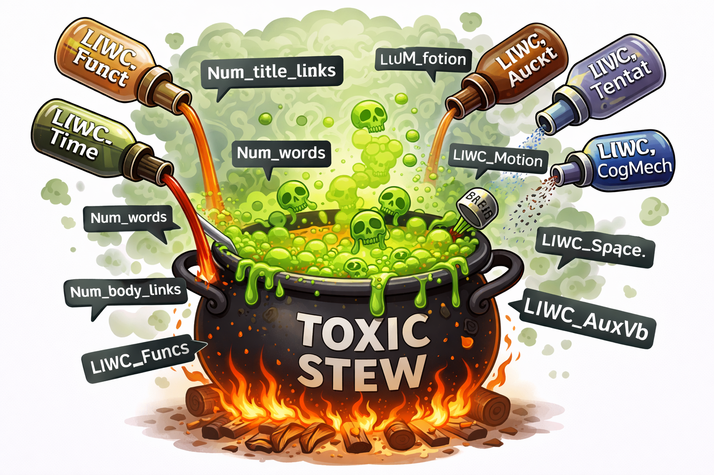
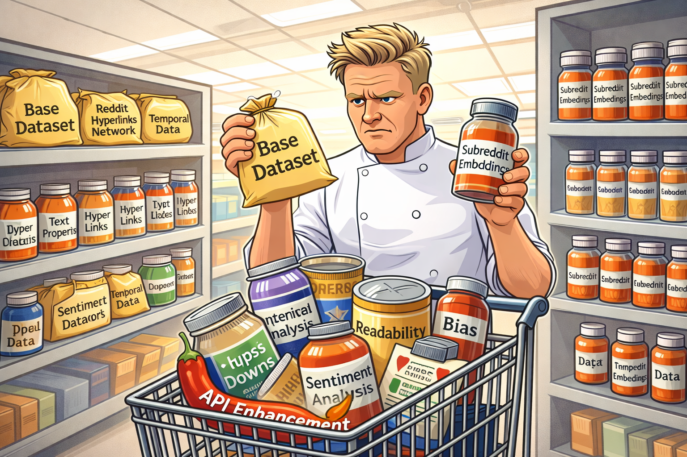
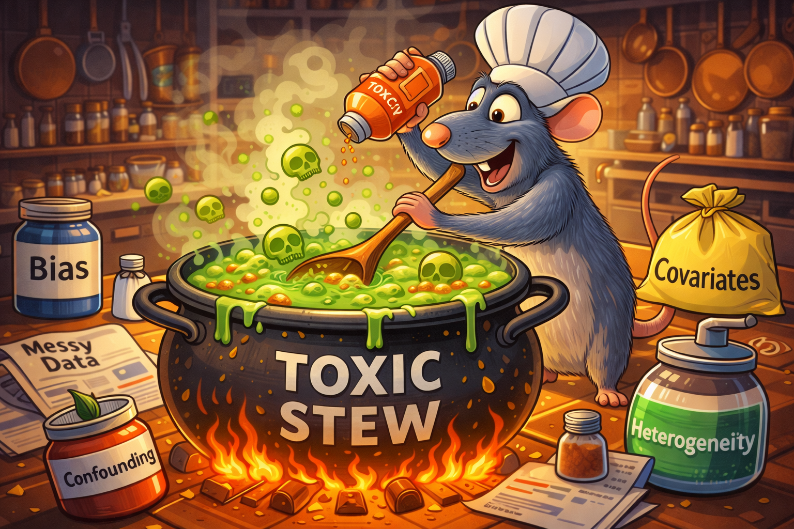
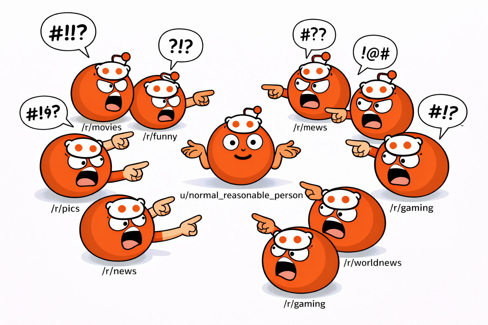
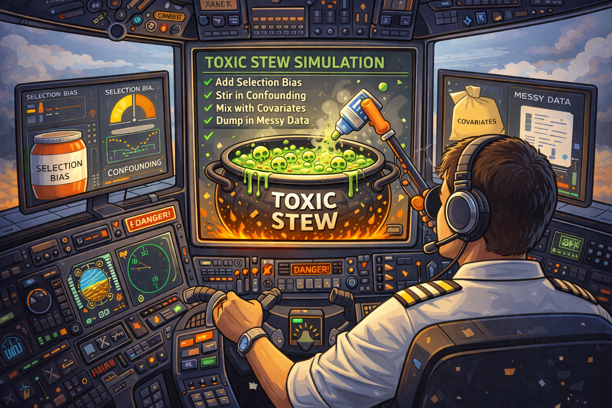

Sometimes becoming viral happens by accident — a single post can transform an unknown user into a household name, launch careers, or even [make you a Millionaire](https://www.reddit.com/r/millionairemakers/comments/2na6tu/reddit_lets_make_a_millionaire). Reddit, with its 430+ million monthly active users, has become a breeding ground for viral content that shapes public discourse, from [GameStop's stock surge](https://www.idealogic.io/blog/reddit-vs-wallstreet-gamestop-saga-explained) to [political movements](https://utsc.utoronto.ca/news-events/breaking-research/reddit-experienced-huge-spike-political-polarization-2016-it-wasnt-driven) and [cultural phenomena](https://ephemerajournal.org/contribution/everything-you-need-know-about-wallstreetbets-explainer-online-forum-behind-gamestop). There are plenty of reasons for wanting to author a viral post but how does one do that? The first thing you should probably do is *talk about something interesting* and add your original view of the matter, which in the context of Reddit implies making a so-called **cross-linking post** in which you refer to another post and add your own context to it. But just posting any cross-linking post is not enough, a good viral post mixes a number of important characteristics to stand out from hundreds of thousands of new posts each day. To help you make sense of all this we present **Toxic Stew** - a cookbook containing all the ingredients you need to cook up the perfect cross-linking post and become the next Reddit sensation.

# Preface 🗿

Every cookbook preface is unnecessarily long and emotional. We will spare you that part 🥱.  
Every cookbook preface ends with a simple promise: follow these recipes, and you’ll create something unforgettable 😏. 
This one keeps that promise - although what you create might be unforgettable for different reasons.
Before diving into the dishes, let’s prepare our ingredients.

# Ingredients / Dataset
A good recipe carefully chooses their ingredients. After long consideration, we decided to source the base ingredients and seasoning from the [Stanford SNAP Reddit datasets](https://snap.stanford.edu/data/index.html), and the toppings from [The official Reddit API](https://www.reddit.com/api/v1).

## Basic Ingredients - Base Dataset 🧑‍🌾

The basic ingredients are extracted from the **[Reddit Hyperlinks Network](https://snap.stanford.edu/data/soc-RedditHyperlinks.html)** which contains:

- A directed, temporal network of subreddit-to-subreddit hyperlinks
- **858,490 hyperlinks** between 55,863 subreddits
- Sentiment analysis of cross-subreddit posts
- Text properties including readability, sentiment, and linguistic features
- Temporal data spanning January 2014 to April 2017

## The Seasoning - Subreddit Embeddings 🧂
The seasoning, which makes the stew more enjoyable is extracted from **[Reddit User and Subreddit Embeddings](https://snap.stanford.edu/data/web-RedditEmbeddings.html)** which was chosen because:

- it contains **300 dimensional embeddings for each subreddit** for more than 30,000 subreddits
- Covers more than 90% of the cross-linking posts from the base dataset

## The Topping - API enhancement 🌶️

The following ingredient is optional but highly recommended for more sophisticated and advanced taste palettes. It cannot be found in the basic dataset, one must go to data scraping. The data has been lawfully scraped across **150 hours** from **[The official Reddit API](https://www.reddit.com/api/v1)**.  
With this, we get the following additional ingredients for each of the cross-linking posts:

- `ups` (number of upvotes)
- `downs` (number of downvotes)
- `score` (number of upvotes - number of downvotes)
- `subreddit_subscribers` (number of subscribers to source subreddit)

## Ingredient Summary
We made sure that the ingredients of our cookbook work well together. In the following plot, we show that these ingredients leave us with a large share of posts that can be integrated in the stew. We forfeit some posts are missing the subreddit embeddings, and some that are not available for scraping on Reddit as they have been removed. But it's no biggie, consider these posts like the bad part of an avocado that we have to sacrifice in order to make the overall stew better. And who knows, some of these posts might be used later in the cookbook again (we are pro-compost here). Additionally, we used posts that appear multiple times in the dataset (due to multiple links - one post can cross-link to multiple posts simoultaneously, in our dataset there exists a post that cross links 167 other posts!) only once, as they would otherwise add a heavy bias. But this information is not completely unused, as we elaborate on later. 👀 The following chart summarizes what we are left with.

<noscript></noscript>

## Secret Ingredient - Virality 🪺
Oh, and we almost forgot the most important part. For the first time in history, we  reveal the top secret of our trade. This is truly the ingredient that will make your stew irresistible to all your friends (and enemies) alike. It is something you can only make yourself; it is not sold by any gypsies in any markets around the world. This ingredient is ✨virality✨. More particularly, _relative virality score per subscriber_ (`virality_rss`) And the secret formula to make this metric is as follows:   
`virality_rss` = (2* `ups` + `downs`) / sqrt(`subreddit_subscribers` + 1)   
What makes this metric so special is that is really captures the essence of what it is to be viral in a given community. The post is viral if it received many reactions, however upvotes are more important than downvotes therefore we multiply them by 2. With the denominator containing <i>subreddit_subscribers</i>, the virality standard accounts for the size of the subreddit in which the post originates. To be considered viral in a bigger community, a bigger score is needed, and virality is not penalized if the community itself is smaller.

# Setting the Table - Community detection 🍽️

As you are cooking, it is important to keep your space clean. Any chef knows that dry and wet ingredients must be mixed separately, and proper cleaning practices need to be observed to prevent cross-contamination, food poisoning, and death 🪦.  
We take subreddit embeddings from **[Reddit Embeddings](https://snap.stanford.edu/data/web-RedditEmbeddings.html)** which includes vector representations of subreddits for and use the principles of **Unsupervised learning** on them. We hierarchially perform Leiden clustering on the subreddit embeddings to obtain 4 levels of clusters. With the help of Gemini LLM we name all of the clusters at all levels based on the names of the subreddits they contain. At the highest level we end up with 7 distinct clusters which can be viewed as larger Reddit communities. The following plot shows the first two levels of clusters along with some representative subreddits inside each of them - click into the clusters to explore further.

<strong>🧑‍🍳 For cooking nerds: Leiden clustering</strong>



<strong>Leiden clustering</strong> works by maximizing <strong>modularity</strong> — trying to group nodes so that clusters have strong internal connections but weak connections between them.

Before applying Leiden clustering, we first construct a <strong>$k$-nearest neighbor ($k$-NN) graph</strong> from the subreddit embeddings. For each subreddit, we connect it to its $k$ most similar subreddits based on <strong>cosine similarity</strong> of their embedding vectors, creating an undirected graph where edge weights represent similarity scores. We then prune edges with similarity below a threshold to keep only strong connections. $k$ is a hyperparameter, in our case we chose $k=15$ and $prune\_threshold = 0.3$.

The modularity score is defined by:

$$
Q = \frac{1}{2m} \sum_{i,j} \left( w_{ij} - \frac{k_i k_j}{2m} \right)\,\mathbb{1}(c_i = c_j)
$$

Where:

<ul>
  <li>$w_{ij}$ is the <strong>cosine similarity</strong> between embeddings of subreddits $i$ and $j$, representing how similar the subreddits are,</li>
  <li>$k_i = \sum_j w_{ij}$ is the total similarity weight of all edges connected to subreddit $i$ (sum of similarities to all its neighbors in the $k$-NN graph),</li>
  <li>$m = \frac{1}{2} \sum_{i,j} w_{ij}$ is the total similarity weight of all edges in the $k$-NN graph,</li>
  <li>$c_i$ is which <strong>cluster</strong> subreddit $i$ belongs to,</li>
</ul>

<noscript></noscript>

Of course, these clusters have a different share of members within each. We compare the share of scraped posts per cluster by the share of unscraped posts per cluster (the posts that were deleted or belong to the cluster for which we do not have the embedding).

<noscript></noscript>

TODO: add what we can infer from that plot

# Aperitivo - Initial Analysis 🍷
We begin the meal with a light refreshment: a first glimpse at our secret ingredient, _virality_. As the plot shows, the majority of posts revolve around a low virality rss score (since we expect virality score distribution to be a [power law](https://en.wikipedia.org/wiki/Power_law) we plot it on log-log scale). Only a few outliers can be spotted on the viral part of the metric. 

Before diving into complex modelling, we take a step back and examine how virality behaves across the different clusters of Reddit communities. The bar chart gives us an early hint: the mean virality score isn’t uniform at all. Some clusters consistently produce more “viral-leaning” posts than others. This tells us that we cannot treat virality the same across all clusters. We need to be careful to separate them as being "viral" might have a different meaning in a cluster with higher engagement rates. This, however, does not mean that we cannot be viral at all in the others. 

<noscript></noscript>

💡 It seems like there is a difference between the mean of the virality score (Virality RSS) among communities. Lets do a statistical test to prove this.  

We will use a **t-test** 🫖 between all cluster pairs to understand whether the differences in average virality between these clusters are statistically significant. After performing pairwise _t-tests_ on all clusters, we obtain the following covariance matrix of p-values.

<strong>🧑‍🍳 For cooking nerds: t-test</strong>



To formally test whether differences in average virality between clusters are meaningful,
we use a <strong>two-sample t-test</strong>. The t-test evaluates whether the observed difference
in means between two groups is larger than what would be expected from random variation alone.

<h4>Test statistic</h4>

For two clusters with sample means $\bar{x}_1$, $\bar{x}_2$, variances $s_1^2$, $s_2^2$, and
sample sizes $n_1$, $n_2$, the t-statistic is:

$$
t = \frac{\bar{x}_1 - \bar{x}_2}{\sqrt{\frac{s_1^2}{n_1} + \frac{s_2^2}{n_2}}}
$$

This statistic measures how far apart the cluster means are relative to their pooled uncertainty.

<h4>Hypotheses</h4>

<ul>
  <li><strong>Null hypothesis ($H_0$):</strong> The two clusters have equal mean virality.</li>
  <li><strong>Alternative hypothesis ($H_1$):</strong> The mean virality differs between clusters.</li>
</ul>

<h4>p-value interpretation</h4>

The p-value represents the probability of observing a difference at least as extreme as the one
measured, assuming the null hypothesis is true. A threshold of $p < 0.05$ is used to indicate statistical significance.

<h4>Application to virality</h4>

In our analysis, we perform pairwise t-tests across all cluster pairs using the
<code>virality_rss</code> metric. Significant p-values indicate that differences in average
virality between clusters are unlikely to be explained by random fluctuation alone, motivating
cluster-specific analyses rather than treating Reddit as a homogeneous population.

<h4>Limitations</h4>

While the t-test detects differences in means, it does not explain <em>why</em> clusters differ,
nor does it account for confounding factors or non-normality. It serves as a diagnostic tool
rather than a causal analysis.

*Most p-values outside main diagonal are below 0.05 (one excecption - gaming & interactive entertainment / pop culture & media). Some are much closer to 0 than others, which we convey with a -log scale on the color bar axis.*

💡Since most p-values are below 0.05, we conclude that the differences in means between our different communities are statistically significant.

# Let Us Cook - Temporal Analysis 🍳

A stew requires time to simmer 🛁, so that the flavours can open up and flourish. In most cases, the tastes blend together in an expected way, but in special situations, one persistent flavour can rise to the top. This brings us to our temporal analysis where we plot `virality_rss` of each cluster overtime. We first calculate the moving average and moving standard deviation of `virality_rss` with the 60-day window for each cluster. For each datapoint we than calculate the **z-score** that tells us how many moving standard deviations above moving average the datapoint lies. The plots below show the moving average virality score for each cluster.

<strong>🧑‍🍳 For cooking nerds: Moving average, moving standard deviation, z-score</strong>



<h3>Moving Average</h3>

The moving average (also called rolling average) at time $t$ over a time-based window of size $w$ (e.g., 60 days) is computed separately for each subreddit cluster:

$$\bar{x}_t^{(w)} = \frac{1}{n_t} \sum_{i \in W_t} x_i$$

where $x_i$ represents the virality_rss score at time $i$, $W_t$ is the set of observations within the time window $[t-w, t]$, and $n_t$ is the number of observations in that window. This gives the mean of all posts within the $w$-day window ending at time $t$, calculated independently for each cluster.

<h3>Moving Standard Deviation</h3>

The moving standard deviation at time $t$ over a time-based window of size $w$ is:

$$\sigma_t^{(w)} = \sqrt{\frac{1}{n_t-1} \sum_{i \in W_t} (x_i - \bar{x}_t^{(w)})^2}$$

This measures the variability of posts within the $w$-day window around their rolling mean.

<h3>Z-Score</h3>

The z-score (standard score) normalizes a post's virality_rss by expressing how many moving standard deviations it is away from the moving mean within its cluster:

$$z_t = \frac{x_t - \bar{x}_t^{(w)}}{\sigma_t^{(w)}}$$

where $x_t$ is the current post's virality_rss, $\bar{x}_t^{(w)}$ is the rolling mean for that cluster, and $\sigma_t^{(w)}$ is the rolling standard deviation for that cluster. A z-score of 0 means the post equals the cluster's mean, while positive (negative) z-scores indicate values above (below) the cluster's mean.

Most posts will end with `virality_rss < 1`, but scattered above, outliers emerge 🦅. Some of the outlier posts with high virality score are shown as dots above the moving average - hover over them with mouse to get more information. We study what separates these posts and causes high viral factor.

<ul class="nav nav-tabs" id="viewTabsa" role="tablist">
  <li class="nav-item" role="presentation">
    <button class="nav-link active" id="viewa1-tab" data-toggle="tab" data-target="#viewa1" type="button" role="tab" aria-controls="view1" aria-selected="true">Gaming</button>
  </li>
  <li class="nav-item" role="presentation">
    <button class="nav-link" id="viewa2-tab" data-toggle="tab" data-target="#viewa2" type="button" role="tab" aria-controls="view2" aria-selected="false">Politics</button>
  </li>
  <li class="nav-item" role="presentation">
    <button class="nav-link" id="viewa3-tab" data-toggle="tab" data-target="#viewa3" type="button" role="tab" aria-controls="view3" aria-selected="false">Meta</button>
  </li>
  <li class="nav-item" role="presentation">
    <button class="nav-link" id="viewa4-tab" data-toggle="tab" data-target="#viewa4" type="button" role="tab" aria-controls="view4" aria-selected="false">Lifestyle</button>
  </li>
  <li class="nav-item" role="presentation">
    <button class="nav-link" id="viewa5-tab" data-toggle="tab" data-target="#viewa5" type="button" role="tab" aria-controls="view5" aria-selected="false">Sports</button>
  </li>
  <li class="nav-item" role="presentation">
    <button class="nav-link" id="viewa6-tab" data-toggle="tab" data-target="#viewa6" type="button" role="tab" aria-controls="view6" aria-selected="false">Pop Culture</button>
  </li>
  <li class="nav-item" role="presentation">
    <button class="nav-link" id="viewa7-tab" data-toggle="tab" data-target="#viewa7" type="button" role="tab" aria-controls="view7" aria-selected="false">Technology</button>
  </li>
</ul>

  

    
<noscript></noscript>

  

  
  

    
<noscript></noscript>

  

  
  

    
<noscript></noscript>

  

  
  

    
<noscript></noscript>

  

  
  

    
<noscript></noscript>

  

  

    
<noscript></noscript>

  

  

    
<noscript></noscript>

  

💡 Certain clusters have a trend of having a higher virality score over time. For instance, the Pop Culture & Media cluster seems to steadily rise across the 3 years of data. We must take this into account to not add bias! 
Taking a closer look, can we find when exactly the different clusters have their peaks? What can we relate them to? We consider communities' popularity over time. We plot the geometric mean of `virality_rss` per cluster over time and watch the race to the top 🐇🐢. 

<strong>🧑‍🍳 For cooking nerds: Geometric mean</strong>



<h3>Geometric Mean</h3>

The geometric mean at time $t$ over a time-based window of size $w$ is computed separately for each subreddit cluster:

$$GM_t^{(w)} = \left(\prod_{i \in W_t} x_i\right)^{1/n_t} = \sqrt[n_t]{\prod_{i \in W_t} x_i}$$

where $x_i$ represents the virality_rss score at time $i$, $W_t$ is the set of observations within the time window $[t-w, t]$, and $n_t$ is the number of observations in that window. The geometric mean gives the $n_t$-th root of the product of all posts within the $w$-day window ending at time $t$, calculated independently for each cluster. Unlike the arithmetic mean, the geometric mean is less sensitive to extreme outliers therefore we use it here to prevent one post with extremely high virality score from shifting the mean of the cluster too much.

<noscript></noscript>

💡 We can see quite a few overtakes! What could have driven these? We did some research on what might have caused the swaps in position of average virality score. We believe that these major events played a key role in shaping the dynamics of the virality race over time, hover over them and find out what impact they had: 

<noscript></noscript>

# Antipasti - Virality Factors 🫒

Now it's finally time to get into the nitty-gritty of virality. What combination of ingredients are actually needed to go viral? We rely on `virality_rss` to define whether a post is viral or not. As we described above, we have to consider the communities and also factor in time (for example from the temporal analysis plot we can see that the average `virality_rss` is increasing over time in the Politics cluster meaning that higher virality score should be required for the post to be marked as viral in 2017 compared to 2014). We define the binary variable `is_viral` to tell us whether a given post in our dataset is viral. To do this we again calculate the moving average and moving standard deviation with the 60-day window for each cluster. For each datapoint we again calculate the **z-score** that tells us how many moving standard deviations above moving average the datapoint lies. In each cluster we mark a post as viral if it lies in the top 2% of points by the z-score.

The rest of the variables are used in the furhter analysis to determine which ones actually determine virality. We also added two more features, <i>num_title_links</i> - number of cross-links to other posts that a given post has in the title; and <i>num_body_links</i> - number of cross-links in the body, which follows our promise that data on parallel cross-links is not lost entirely. Could linking multiple posts impact virality, what about other features? We bet you can't wait to find out! 😎

## Logistic Regression 🪵
Now we bring out the heavy ML machinery. We first train a **logistic regression model**. This yields the coefficients displayed in the plot below - each coefficient tells us how significantly the value of a numerical coefficient impacts virality. Since we are using a statistical library [statsmodels](https://www.statsmodels.org/stable/index.html) to fit a linear model each coefficient also comes with a p-value, describing the probability of observing such an extreme coefficient value under the null hypothesis that the true coefficient is zero. All of the shown coefficients have p-value below 0.05 (hover over the coefficient so see its full name and its p-value). Before we apply the logistic regression we make sure to remove the features that heavily correlated since such features might cause the coefficients to become unstable - for this we use **Pearson correlation coefficient** and remove one feature out of a pair of features with absolute correlation coefficient above 0.9 (example of such features is `num_characters` and `num_characters_no_space`). 

<strong>🧑‍🍳 For cooking nerds: Pearson correlation coefficient</strong>



<h3>Pearson Correlation Coefficient</h3>

The Pearson correlation coefficient $r$ measures the linear relationship between two variables $X$ and $Y$. It is defined as:

$$r = \frac{\sum_{i=1}^{n}(x_i - \bar{x})(y_i - \bar{y})}{\sqrt{\sum_{i=1}^{n}(x_i - \bar{x})^2}\sqrt{\sum_{i=1}^{n}(y_i - \bar{y})^2}} = \frac{\text{Cov}(X,Y)}{\sigma_X \sigma_Y}$$

where $\bar{x}$ and $\bar{y}$ are the sample means, $\text{Cov}(X,Y)$ is the covariance, and $\sigma_X$, $\sigma_Y$ are the standard deviations of $X$ and $Y$ respectively.

The correlation coefficient ranges from $-1$ to $+1$:

<ul>
<li>$r = +1$: Perfect positive linear relationship</li>
<li>$r = 0$: No linear relationship</li>
<li>$r = -1$: Perfect negative linear relationship</li>
</ul>

Values closer to $\pm 1$ indicate stronger linear relationships, while values closer to $0$ suggest weak or no linear association. Note that correlation measures only linear relationships and does not capture nonlinear associations which means we have to assume that all the correlations in our data are linear.

<strong>🧑‍🍳 For cooking nerds: Logistic regression</strong>



<h3>Logistic regression</h3>

Logistic regression models the probability of virality given the properties $\mathbf{x}$ using the logistic function $\sigma$:

$$P(\text{is_viral} = 1 | \mathbf{x}) = \sigma(\mathbf{x}^T \boldsymbol{\beta}) = \frac{1}{1 + e^{-(\beta_0 + \sum_{i=1}^{p} \beta_i x_i)}}$$

Logistic regression models the log-odds as a linear combination of features:

$$\text{logit}(p) = \ln\left(\frac{p}{1-p}\right) = \beta_0 + \beta_1 x_1 + \beta_2 x_2 + \ldots + \beta_p x_p$$

where $p = P(\text{is_viral} = 1 | \mathbf{x})$ and $\text{logit}$ is the inverse of Logistic function $\sigma$. Coefficients are estimated via Maximum Likelihood Estimation, maximizing the <i>log-likelyhood</i>:

$$\ell(\boldsymbol{\beta}) = \log P(\boldsymbol{\beta}|\boldsymbol{X}, \boldsymbol{y})= \sum_{i=1}^{n} \left[ y_i \ln(p_i) + (1-y_i) \ln(1-p_i) \right]$$

<h3>P-Value</h3>

For each coefficient $\beta_j$, we test the null hypothesis $H_0: \beta_j = 0$ against the alternative $H_1: \beta_j \neq 0$. The p-value is the probability of observing a test statistic $Z$ at least as extreme as the observed value, assuming $H_0$ is true:

$$p\text{-value} = P(|Z| \geq |z_{\text{obs}}| \mid H_0)$$

where $Z$ follows a standard normal distribution and $z_{\text{obs}} = \frac{\hat{\beta}_j}{\text{SE}(\hat{\beta}_j)}$ is the observed z-statistic, with $\hat{\beta}$ being the value of the coefficient and $\text{SE}(\hat{\beta}_j)$ being the standard error of the coefficient estimate.

<noscript></noscript>

💡Logistic regression shows that having many words and especially using a high number of function words (the words with little lexical meaning eg. articles, prepositions ...) and timing words has a large positive impact on virality while having a large share of relative pronouns (common in storytelling), auxiliary verbs and word "I" decreases the chance. This tells us that having lenghtier and more precise descriptions that are treated in a more objective way are generally correlated to higher chances of virality. Positive effect of timing words suggest it is better to talk about topics that require time perspective (eg.important present, past or future event). It is also beneficial for the post to have a high number of cross-links (for example because the post is a comprehensive review of a topic potentially linking dozens of other posts). 

Interestingly, this analysis marks another factor important (although not listed in the plot above): **Compound VADER sentiment** - with coefficient of `-0.060563` and a p-value `6.251003e-08` which is well below 0.05. This illustrates that the post having negative compound sentiment positively influences the probabiliy of the post going viral. We will explore this further in the section Sentiment analysis.

### Spider Plots 🕷️
Extending our findings from logistic regression, we generate the following spider plots for some isolated highly viral posts. Each plot visualizes the normalized feature profile of a post, highlighting how different combinations of linguistic, sentiment, and structural features can lead to high virality.

<noscript></noscript>

💡We can see that each of these posts exceeds in multiple factors of coefficients that were deemed important by the logistic regression above. In at least three two out of the five main measures <i>Num_words</i>, <i>Negated_sentiment_comp</i>, <i>Negated_LIWC_Relativ</i>, <i>LIWC_Time</i> and negated <i>LIWC_Relativ</i> they place in a very high percentile. None of them exceeds in all measures, but this gives exactly you 🫵 the chance to become viral.

## Random Forest 🌳

Logistic regression is a useful and interpteable tool but it requires the assumption of the linear relation between the logits of virality probability and coefficients. It might be that the relation between features and virality is more complicated than that. There we employ the big guns of ML: **Ansamble methods**, specifically the Random forest classifiers. We train a random forest classifier using [SciKit learn library](https://scikit-learn.org/), and find the following features to be of most importance.

<strong>🧑‍🍳 For cooking nerds: Random Forest Classification</strong>



We use Random Forest to predict binary post virality using LIWC sentiment features, VADER scores, post properties, and cluster memberships.

<strong>Model Architecture:</strong>

<ul>
<li>300 decision trees (n_estimators=300)</li>
<li>Maximum depth of 20 levels</li>
<li>Minimum 5 samples per split, 3 samples per leaf</li>
<li>Class weights: {0:1, 1:70} to handle severe imbalance (2% viral posts)</li>
</ul>

Each tree makes a prediction by recursively splitting on features that maximize information gain:

$$\text{InfoGain} = H(\text{parent}) - \sum_{j=1}^{k} \frac{n_j}{n} H(\text{child}_j)$$

where $H$ is the Gini impurity: $H(S) = 1 - \sum_{i=1}^{c} p_i^2$, and $p_i$ is the proportion of class $i$ in set $S$.

The final prediction aggregates all trees via majority voting:

$$\hat{y} = \text{mode}\left\{ h_1(\mathbf{x}), h_2(\mathbf{x}), \ldots, h_{300}(\mathbf{x}) \right\}$$

<strong>Performance Metrics:</strong>

<ul>
<li><strong>Precision:</strong> Of posts predicted as viral, what percentage actually are viral</li>
<li><strong>Recall:</strong> Of actual viral posts, what percentage we correctly identify</li>
<li><strong>F1 Score:</strong> Harmonic mean of precision and recall: $F_1 = 2 \cdot \frac{\text{precision} \cdot \text{recall}}{\text{precision} + \text{recall}}$</li>
</ul>

<strong>Feature Importance:</strong> Calculated as the average decrease in Gini impurity across all trees when splitting on that feature. Higher values indicate stronger predictive power.

💡 The feature importances largely match the ones found with the logistic regression, giving us more confidence that these correlations are actually valid. We can see that multiple measures corresponding to the length of posts reappear (such as <i>Num_characters_no_space</i>, <i>Num_characters</i>, <i>Avg_word_length</i>) as well as the functional words. There are, however, some other metrics, such as <i>Frac_special</I> and <i>Frac_uppercase</I>, both of which were also statistically significant in the logistic regression (although with lower coefficients) for positively impacting virality. Therefore, having a higher share of those characters might also help to become viral!

### Predicting Virality of Unscraped Posts 🔮
Through scraping the dataset, we come across posts that cannot be found on Reddit anymore, and thus could not have been scraped.  
To not lose insight from these posts, we extend our analysis and apply our random forest classifier to predict whether these posts have virality potential. Hence, using the same random forest algorithm (with parameters described in the cooking for nerds section), we predict that slightly more than 2% of the missing posts went viral.

<noscript></noscript>

💡 It also once again shows a difference between clusters. We cannot say for sure as Reddit deleted those posts, but seems like many viral posts in the Pop Culture community fell victim to Reddit removing their viral posts. Maybe this gives you 🫵 the chance to become a viral sensation in Pop Culture and Media. Just make sure to not include anything that will get your post deleted.

# Primi - Sentiment Analysis 😃😐🙁

Some viral posts can be positive and uplifting, but the reality is that they are also often negative, hence the stew being... toxic... ☠️ but viral, nonetheless. In the previous chapter we have seen that being negative can improve your chances of becomming viral, but than the question arises - who to hate on? The toxicity of the post is defined by the negative compound [VADER sentiment](https://github.com/cjhutto/vaderSentiment). As we suspect that sentiment plays a big role in virality, we begin by looking at sentiment comprising our various clusters:

<strong>🧑‍🍳 For cooking nerds: What defines the sentiment of a post</strong>

For defining the sentiment of a post, we relied on the VADER properties of the posts. VADER (Valence Aware Dictionary and Sentiment Reasoner) gives every post a normalized compound rating from -1 to +1 in terms of sentiment. +1 denotes a overwhelmingly positive post while -1 means a whole lot of negativity. We have defined the sentiment according to the <i>Sentiment_compound_vader</i> property as follows:

$$
\text{label}(x)=
\begin{cases}
\text{positive}, & x>0.05,\\
\text{neutral}, & -0.05 \ge x < 0.05 \\
\text{negative}, & x \le -0.05.
\end{cases}
$$

<noscript></noscript>

💡 Most posts are positive or neutral, but Politics & Society and Reddit Meta & Community have the highest proportion of negative posts.  

Lets also analyze the sentiment of the posts that could not be scraped to see if there are any imbalances present among the removed posts.

<noscript></noscript>

💡 There is a slightly higher proportion of negativity in the unscraped posts than in the scraped ones of the same cluster. However, it is not significant enough to confidently say that many posts were deleted because they were too negative.

### Who to hate on?

If you are one of those people who doesn't mind to become viral by all means and decide to post a negative cross-linking post you might be interested where to find an existing post to talk negatively about? You should probably talk negatively about subreddit which is is already hated on by the majority of the subreddit in which you are planning to post into. To help you decide we turn to [Graph theory](https://en.wikipedia.org/wiki/Graph_theory) and construct a **directed Hate graph** between subreddits using [NetworkX Python library](https://networkx.org/en/).

<strong>🧑‍🍳 For cooking nerds: Directed Graphs, Multigraphs, hate graphs</strong>



<strong>Directed Weighted Graph:</strong> A graph $G = (V, E)$ where $V$ is a set of nodes and $E \subseteq V \times V$ is a set of ordered pairs $(u, v)$ representing directed edges from node $u$ to node $v$. Each edge $(u, v)$ has an associated weight $w(u, v) \in \mathbb{R}$

<strong>Directed Multigraph:</strong> A generalization of a directed graph where multiple edges can exist between the same ordered pair of nodes.

<strong>Hate graph:</strong>
Firstly we use the dataset directly to construct NetworkX multigraph where nodes are subreddits and each edge represents a single post linking from a source subreddit to a target subreddit. Multiple edges can exist between the same $(u, v)$ pair, representing all posts from subreddit $u$ to subreddit $v$.

To each of the edges of the multigraph we assign <strong>Emotional Toxicity Metric:</strong>

$$\text{emotional_toxicity}_p = \frac{1}{6}\left(\text{vader_negative}_p + \text{negemo}_p + \text{anger}_p + \text{anxiety}_p + \text{sad}_p + \text{swear}_p\right)$$

where each component is extracted from the post's LIWC and VADER sentiment analysis of the post $p$

We want to measure the amount of hate between communities. For this we use the input multigraph and aggregate parllel edges to obtain a NetworkX directed weighted graph.

For each directed edge $(u, v)$ in the output graph, we aggregate all posts from subreddit $u$ to subreddit $v$ that match the target sentiment. The edge weight is computed as the arithmetic mean of emotional toxicity scores across all such posts:

$$w(u, v) = \frac{1}{|P_{u,v}|} \sum_{p \in P_{u,v}} \text{emotional_toxicity}_p$$

where $P_{u,v}$ is the set of all posts from subreddit $u$ to subreddit $v$ with the specified sentiment value.

<noscript></noscript>

💡 As we explore the pathways of hate, we see some unsurprising results. For example, `r/anarchism` hates `r/protectandserve` (a community for law enforcement officers) and `r/gamerghazi`, a far-left community, hates `r/8chan`, a far-right community.

# Secondi - Central Graph Analysis 🍛

The next course on the menu is investigating interactions between subreddits. We start by analyzing, which community is typically linked by the posts. The following chord diagram visualizes cross-cluster interaction volume, where ribbon thickness represents the number of words exchanged between clusters. It highlights which communities are most strongly entangled in cross-linked discussions.

<noscript></noscript>

💡 Every cluster has a lot of intra-cluster interactions, and exchange inter-cluster interactions with other large clusters, prominintely Reddit Meta.

<noscript></noscript>

💡However, we can see that for the purpose of virality analysis, it does not really matter if a post targets its own Community or another one. Therefore, our analysis has to go deeper.   

## Centrality of virality

We want to see which of the subreddits are the most "central" to virality (meaning that they themselves post many viral posts and also many viral posts in other subreddits are cross-linking them). You as the user of our cookbook can use this info to perhaps follow what is happening on those subreddits to have a better chance of spotting an emerging viral trend. Also if you are deciding where to post it makes sense to post and cross-link a post with high centrality. To determine which subreddits are the most central, we used the _weighted PageRank centrality_ algorithm. In the same manner as above we construct a graph where each edge represents the aggregated weight using geometric mean for aggregation and `virality_rss` as the edge weights in the multigraph. We then run a PageRank algorithm on that graph. We plot interactions among the top ranked subreddits - click on the individual node to inspect its neighbourhood.

<strong>🧑‍🍳 For cooking nerds: Weighted PageRank centrality</strong>



Given a directed, weighted graph with adjacency matrix $W$ (representing the aggregated virality_rss weights), the PageRank score of node $i$ is defined recursively as:

$$
PR(i) = \frac{1 - \alpha}{N} + \alpha \sum_{j \in \mathcal{N}_{\text{in}}(i)} \frac{w_{ji}}{\sum_{k} w_{jk}} PR(j)
$$

where:

<ul>
  <li>$\alpha \in (0,1)$ is the damping factor (in our case $\alpha = 0.85$),</li>
  <li>$N$ is the total number of nodes,</li>
  <li>$w_{ji}$ is the weight of the directed edge from node $j$ to node $i$,</li>
  <li>$\mathcal{N}_{\text{in}}(i)$ denotes the set of nodes pointing to $i$.</li>
</ul>

A node receives high PageRank if it is pointed to by other nodes that themselves have high PageRank, with edge weights modulating the strength of influence.

<strong>Interpretation:</strong> In our context, a subreddit with high weighted PageRank acts as a
central aggregation point for virality: it consistently receives interaction or content flow from many other influential subreddits.

<noscript></noscript>

💡 The subreddit with the highest PageRank is `r/iama`, and as expected its neighbourhood is well connected (because of the recursive definition of PageRank). The most prominent subreddits in our network analysis are either massive communities with millions of subscribers (such as `r/india`, one of the largest country-specific subreddits), divisive communities that inherently drive engagement through controversial or emotionally charged content (such as `r/politics` with political debates or `r/wtf`, which curates shocking and attention-grabbing content), and communities with interactive Q&A structure (such as `r/iama` and `r/ama`, where celebrities and notable figures answer questions in real-time, creating threads that can receive tens of thousands of upvotes and become cultural touchstones). As mentioned since these communities are huge our cookbook recipe does not necessarily force you to post into one of them (it might be better to focus on the niche subreddits) but the analysis certainly proves that those are the one to follow if you want to come across as many viral posts as possible and draw the inspiration for your own creations.

# Contorni - Textual Analysis of Post Titles 🥗

Of course, no menu is complete without Term Frequency - Inverse Document Frequency (TF-IDF) 😋. A post's title is the first thing a Reddit user sees, and largely motivates the split-second decision of whether to click on the post. To analyze what makes a good title we perform **Term Frequency - Inverse Document Frequency** (TF-IDF) on post titles and follow-up with a **linear regression**, to see what words in the title correspond to increase in virality. The $R^2$ metric is used to assess the amount of explained variance a title has on the post's virality.

<strong>🧑‍🍳 For cooking nerds: TF-IDF + Linear regression</strong>



<h4>TF-IDF representation</h4>

Each post title is transformed into a numerical vector using
<strong>TF-IDF (Term Frequency–Inverse Document Frequency)</strong>, which assigns higher weight
to words that are frequent within a title but rare across the corpus.

For a word $w$ in title $d$, the TF-IDF score is:

$$
\text{TF-IDF}(w, d) = \text{TF}(w, d) \cdot \log\left(\frac{N}{\text{DF}(w)}\right)
$$

where:

<ul>
  <li>$\text{TF}(w, d)$ is the frequency of $w$ in title $d$,</li>
  <li>$\text{DF}(w)$ is the number of titles containing $w$,</li>
  <li>$N$ is the total number of titles in the cluster.</li>
</ul>

<h4>Linear regression model</h4>

The TF-IDF vectors are then used as input features in a linear regression model
predicting the logarithm of virality score (we first transform virality score using log because of vast span of values virality score can take):

$$
\log(y) = \beta_0 + \sum_{j=1}^{p} \beta_j x_j + \varepsilon
$$

where $y$ is the virality score and $x_j$ are TF-IDF features.
Coefficients are estimated by minimizing the sum of squared residuals:

$$
\min_{\boldsymbol{\beta}} \sum_{i=1}^{n} (y_i - \hat{y}_i)^2
$$

<h4>Model evaluation</h4>

Model performance is assessed using the $R^2$ metric:

$$
R^2 = 1 - \frac{\sum_i (y_i - \hat{y}_i)^2}{\sum_i (y_i - \bar{y})^2}
$$

$R^2$ ranges from $0 \le R^2 \le 1$, where $R^2=0$ means the title does not have any effect on virality, and $R^2=1$ means the title explains all the variance.

The relatively low $R^2$ values are expected: title text explains only a small fraction
of virality, which is heavily influenced by external factors such as timing,
community size, and network effects.

<ul class="nav nav-tabs" id="viewTabs" role="tablist">
  <li class="nav-item" role="presentation">
    <button class="nav-link active" id="view1-tab" data-toggle="tab" data-target="#view1" type="button" role="tab" aria-controls="view1" aria-selected="true">Gaming</button>
  </li>
  <li class="nav-item" role="presentation">
    <button class="nav-link" id="view2-tab" data-toggle="tab" data-target="#view2" type="button" role="tab" aria-controls="view2" aria-selected="false">Lifestyle</button>
  </li>
  <li class="nav-item" role="presentation">
    <button class="nav-link" id="view3-tab" data-toggle="tab" data-target="#view3" type="button" role="tab" aria-controls="view3" aria-selected="false">Politics</button>
  </li>
  <li class="nav-item" role="presentation">
    <button class="nav-link" id="view4-tab" data-toggle="tab" data-target="#view4" type="button" role="tab" aria-controls="view4" aria-selected="false">Media</button>
  </li>
  <li class="nav-item" role="presentation">
    <button class="nav-link" id="view5-tab" data-toggle="tab" data-target="#view5" type="button" role="tab" aria-controls="view5" aria-selected="false">Meta</button>
  </li>
  <li class="nav-item" role="presentation">
    <button class="nav-link" id="view6-tab" data-toggle="tab" data-target="#view6" type="button" role="tab" aria-controls="view6" aria-selected="false">Sports</button>
  </li>
  <li class="nav-item" role="presentation">
    <button class="nav-link" id="view7-tab" data-toggle="tab" data-target="#view7" type="button" role="tab" aria-controls="view7" aria-selected="false">Technology</button>
  </li>
</ul>

  

    <h4>Gaming & Interactive Entertainment</h4>
    
<strong>Model Performance:</strong> R² = 0.057 (5.7% variance explained)

    
<noscript></noscript>

  

  
  

    <h4>Lifestyle & Niche Interests</h4>
    
<strong>Model Performance:</strong> R² = 0.132 (13.2% variance explained)

    
<noscript></noscript>

  

  
  

    <h4>Politics & Society</h4>
    
<strong>Model Performance:</strong> R² = 0.104 (10.4% variance explained)

    
<noscript></noscript>

  

  
  

    <h4>Pop Culture & Media</h4>
    
<strong>Model Performance:</strong> R² = 0.045 (4.5% variance explained)

    
<noscript></noscript>

  

  
  

    <h4>Reddit Meta & Community</h4>
    
<strong>Model Performance:</strong> R² = 0.162 (16.2% variance explained)

    
<noscript></noscript>

  

  

    <h4>Sports & Athletics</h4>
    
<strong>Model Performance:</strong> R² = 0.199 (19.9% variance explained)

    
<noscript></noscript>

  

  

    <h4>Technology & Digital Culture</h4>
    
<strong>Model Performance:</strong> R² = 0.249 (24.9% variance explained)

    
<noscript></noscript>

  

💡 Thus, the way a post is titled has an especially strong effect on virality in the Sports and Technology communities (accounting for approximately 20% and 25% of variance respectively), a reasonable effect on the Lifestyle, Politics, and Meta spheres (more than 10%), and a lesser but still noteworthy effect in the remaining Gaming and Media clusters (around 5%). 
💡 One important finding is that posts that include words like <i>question</i>, <i>help</i>, <i>asking</i> all have negative effects on the virality score. This means that you should be sure of what you are saying. Asking questions or for help does usually not resonate well with the readers.

# Dolci - Propensity Score Matching 🍰
We would never leave you without a sweet treat. To estimate more credible causal effects, we use propensity score matching (PSM). The goal is to compare posts that are similar across observed characteristics, differing mainly in a single feature of interest (the “treatment”).

<strong>🧑‍🍳 For cooking nerds: Propensity score matching</strong>



<h4>Propensity score</h4>

For each post, we estimate the propensity score:

$$
e(\mathbf{x}) = P(T = 1 \mid \mathbf{x})
$$

where $T$ is a binary treatment indicator (e.g. high vs. low anger, long vs. short post),
and $\mathbf{x}$ is a vector of observed covariates. Propensity scores are estimated
using logistic regression.

<h4>Matching</h4>

Each treated post is matched to one or more control posts with similar propensity scores
using nearest-neighbor matching. This creates balanced groups in which the distribution
of observed covariates is similar between treated and control posts.

<h4>Effect estimation</h4>

After matching, we estimate the <strong>Average Treatment Effect on the Treated (ATT)</strong>:

$$
\text{ATT} = \mathbb{E}[Y(1) - Y(0) \mid T = 1]
$$

where $Y(1)$ is the observed virality of treated posts and $Y(0)$ is the counterfactual
virality estimated from matched controls.

<h4>Interpretation</h4>

ATT measures the expected change in virality attributable to the treatment among posts
that actually received it. Positive values indicate that an increase in the feature
causally increases virality on average, while negative values indicate a decrease.

<noscript></noscript>

💡 Post length variables exhibit the strongest positive effects, indicating that longer posts causally increase virality. In contrast, overall positive sentiment has a negative effect, while linguistic complexity and swearing show limited or negligible impact.  

This figure shows how the estimated average treatment effect on virality varies as the post length threshold used to define the treatment is adjusted. We observe the peak of the effect at intermediate lengths and diminishing returns for extreme thresholds.

<noscript></noscript>

💡 The treatment effect peaks at 0.07 when Num_characters = 135.
  

This figure evaluates covariate balance before and after propensity score matching using the Absolute Standardized Mean Difference (ASMD). Prior to matching, treated and control posts differ substantially across many covariates, introducing confounding variables and making naive comparisons unreliable. After matching, ASMD values are dramatically reduced and fall below commonly accepted thresholds, showing that treated and control groups are well balanced on observed characteristics. This improvement in balance is critical, indicating that the estimated treatment effects are not driven by systematic differences in post composition, but instead reflect the effect of the treatment itself. This strengthens the credibility of the causal interpretation.

<noscript></noscript>

💡 After matching, absolute standardized mean differences are substantially reduced across all covariates, indicating that treated and control groups are well balanced. This confirms that propensity score matching was effective and supports the validity of the estimated treatment effects.

# Kids' Menu - Games 🍕

Whether you are a child or a picky eater, we understand that not everyone has the intellect to understand the 'For cooking nerds' sections, so instead, you can learn about virality through a couple of games! 
And of course if you are a nerd, you can still participate. It is a good check to see whether you have learned the theory and are ready to go viral in the practical sense.

<strong>🧑‍🍳 For cooking nerds: Behind the Scenes: How the game was created</strong>

 This game makes use of the `sklearn.tree` library to create a decision tree. For this game, we used a shallow decision tree to make the game shorter and more concise. Firstly, are asking the question of where the user wants to post in and which cluster to use. Since there is no way in a decision tree to force what the first choices should be we created a shallow decision tree for each of the clicked possibilities.

For each of the trees, the following parameters were used:

<ul>
  <li>Max Depth: 5</li>
  <li>Class Weight: Balanced</li>
  <li>Subset of Data: Depends on the first two choices</li>
</ul>

The resulting percentage is fully based on the empirical dataset. The path the user takes corresponds to traversing down the tree step by step. We calculate the share of viral posts on the leaf the user lands on and return this as the result. The idea is to make the game as similar as possible to the strong results obtained from the random forest before, however, it is not possible to traverse down a forest, therefore we have used a tree.

### What decisions would you make to be viral?



### Can you guess which post went viral?

<strong>🧑‍🍳 For cooking nerds: Behind the Scenes: How the game was created</strong>

>This game simply samples viral and non-viral posts from the dataset and lets the user guess, which one of them is viral.



## Summary of Findings (or as they say on Reddit, 👉TLDR)

To leave a good aftertaste, we will summarize the crucial discoveries for you to view them at once glance. **TLDR**:

1. Different clusters of subreddits are statistically significant in their mean virality score.
2. The (geometric) mean virality score evolves differently across clusters over time, and global events influence these trends.
3. Logistic regression shows that the most important features for virality are functional words and time-related words, the number of links, the number of words, and that properties harming virality are relative pronouns and auxiliary verbs.
4. Random forest models confirm the importance of post length and functional words, and additionally highlight the role of social words and alphanumeric characters.
5. Negative sentiment can increase virality, and the structure of Reddit communities forms a structured graph of hate.
6. Whether a post cross-links within the same cluster or across different clusters does not significantly impact virality.
7. Subreddits that are most central to virality tend to be large communities with high activity.
8. For each community, we can identify words that increase the virality score when included in the post title.
9. Propensity score matching confirms the positive impact of post length and negative sentiment on virality.

# Epilogue 🌚

And with this, we conclude the tasting menu of what it takes to go viral. You may try a dish from a chef and it be pure bliss, but when you compliment them or ask for the recipe, they start spewing some crap about it being "made with love" 😒.  
We, on the other hand, are no such gatekeepers. We have discovered that the "magic" really comes down to patterns, algorithms, and data. So straighten your apron, sharpen your knives, and don't just copy yesterday's special like any other sous-chef; be intentional to make yourself stand out 🤌.  
Bon appétit! 😉

## About the Project

This project is part of the Applied Data Analysis (ADA) course at EPFL. Our team, the **Standard Deviants**, is passionate about understanding social media dynamics through data.

## The Team

- Mohamed Aziz Hamza
- Gal Gantar
- Henrik Gruber
- Jack Naimer
- Jane Klavir

---

*Check out our [GitHub repository](https://github.com/epfl-ada/ada-2025-project-standard-deviants-ada) for code, analysis notebooks, and more details!*
